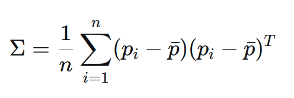

# 1. FAST-LIVO2-PCA

## 1.1. [FAST-LIVO2: Fast, Direct LiDAR-Inertial-Visual Odometry](./README_fast-livo2.md)

按照[fastlivo2的教程](./README_fast-livo2.md)安装配置其标准环境，如果遇到编译错误可参考以下解决方案：[Sophus编译报错](./Supplementary/sophus报错.png)

关于fastlivo2论文和代码的详细讲解可以参考[论文fastlivo2论文详解]()和[fastlivo2工程详解]()、[fastlivo2代码详解]()。

## 1.2. PCA

- 加入了mid360雷达的配置和启动文件 *./src/FAST-LIVO2-PCA/config/mid360.yaml*。
- 将fast-livo2的地图结构从Voxel+OctoMap改为Voxel+PCA Map，并添加了可视化功能，可以实时显示PCA Map。
- 代码修改逻辑是对于 std::unordered_map<VOXEL_LOCATION, VoxelOctoTree *> voxel_map_; 将体素位置键对应的值从 VoxelOctoTree 节点对象换成新的 VoxelKDTree 节点对象。
详情参考[1.3. PCA详解](#13-pca详解)

### 1.2.1. 仅换用mid360雷达和关闭视觉

```bash
roslaunch fast_livo_pca mapping_mid360.launch
```

### 1.2.2. 可视化观察Voxel+OctoMap
关于 *./src/FAST-LIVO2-PCA/rviz_cfg/fast_livo2.rviz* 对于 *src/FAST-LIVO2-PCA/config/mid360.yaml* 配置文件：
1. 将 dense_map_en 参数设置为 false 即可看见降采样后的每帧点云在 /cloud_registered 话题上,设置Decay后可以看见一段时间积累的效果见图片[降采样点云](./Supplementary/down_sample点云降采样效果图.png)，此图是在静止状态下采集的，图中**红色点**是降采样后的原始点，**绿色点**是成功关联到平面的有效匹配点，可以看出[livox雷达的扫描结构](./Supplementary/livox点云扫描结构.png)决定了0.1m的体素立方体降采样得到的点云是分布在各自的领域内的。构建voxel_map_中plane的数据来源就是这些红色的点云。
2. 将 pub_effect_point_en 参数设置为 true 即可看见成功关联到体素平面的点（用于状态估计的有效点）在 /cloud_effected 话题上。关于从体素降采样的输入点云如何拟合平面的流程可以参考图片[点云去向图](./Supplementary/lidar_point雷达点云去向图.png)。
3. 将 pub_plane_en 参数设置为 true 即可看见以 MarkerArray 形式发布所有体素内部的拟合平面（显示为带颜色的扁平圆柱体）在 /planes 话题上，颜色越红表示不确定性越大。
详细参考图片[publish对象解释](./Supplementary/publish对象.png)
关于输出终端中的变量含义详细参考图片[输出变量解释](./Supplementary/输出变量解释.png)

### 1.2.3. 可视化观察Voxel+PCA Map
配置 pca_mapping_en 参数为 true ,即可屏蔽octomap的使用而改用自建的pcamap 

# 1.3. PCA 改进详解
## 1.3.1. 动机
现阶段的fast-livo2流程上是对空间进行三维体素划分，每个点云位于哪个体素内可以按照哈希索引O(1)查找，每个体素内判断能否拟合平面，不能就八叉树递归划分再次判断能否拟合平面，形成根体素和子体素的层级结构，规定最多3层。这样的切分不管是根体素层还是子体素层，都不可避免会存在将一个平面切分到多个体素内的问题，这是比较反人类的操作，所以我们希望能够尽可能实现一个体素就表示一个物体。鉴于结构表示上仅依赖面特征，所以应该表述为**一个体素就表示一个完整平面**。这样做面临一些利弊和挑战：
|利处|弊处|挑战|
|:---:|:---:|:---:|
|每个独立平面都需要6个以上的参数去定义，将平面完整化能够节约内存|在构建时需要额外检查相邻根体素，增加了计算量|避免多个相近平面的错误合并，影响残差的准确性|
|位于体素边界的点云更容易判断更近邻平面，节省了计算时间|完整大平面的相邻体素范围更大|完整平面的边界点云如何查询近邻体素|
|环境信息更加完整化，减弱了面被切分后会形成边界的空旷，对导航友好|不同体素的空间大小存在差异，不够对称|如何在不同大小的体素前提下实现高效查找|

## 1.3.2. 措施
我们采取的措施主要分为两个方面：
### 1.3.2.1. 切分策略
既然fast-livo2对于每个体素内的点云都会做特征值和特征向量的计算(*Eigen::EigenSolver<Eigen::Matrix3d> es(plane->covariance_);*)，那么我们完全可以对此计算结果进行充分利用，进行PCA（主成分分析）。

PCA是一种降维算法，其核心思想是找到数据分布的主方向，并按照主方向对数据进行降维。[用最直观的方式告诉你：什么是主成分分析PCA](https://www.bilibili.com/video/BV1E5411E71z/?share_source=copy_web&vd_source=6e8a12aa7697ff4588bb7250abe4bfb0)。
统计学上对于三维数据，其协方差矩阵

对其特征值分解的特征向量表示**数据分布的主方向**，三个特征值表示**点云在对应特征向量方向上的方差大小**。所以如果有一个特征值特别小，表示这个方向上分布非常集中，接近于一个平面。

首先明确，对于一个体素内的多个平面，仅通过整体的特征分解结果无法判断详细情况，想要做出准确的划分需要针对局部点云进行更多的额外计算。并且PCA对离群点非常敏感，会严重影响拟合平面的准确性。

如果环境复杂，在0.5m的经验体素大小下，大概率同时存在多个平面，这时不存在一个特别小的特征值，按fastlivo2会进行八叉树的切分，目的是在更小的体素大小下看能否更好地拟合平面，但我们认为这种切分显得过于机械而不优雅。我们希望通过一些简单的分析，让切点和切向的选取更加灵活。
#### 1.3.2.1.1. 切向的选取

 


